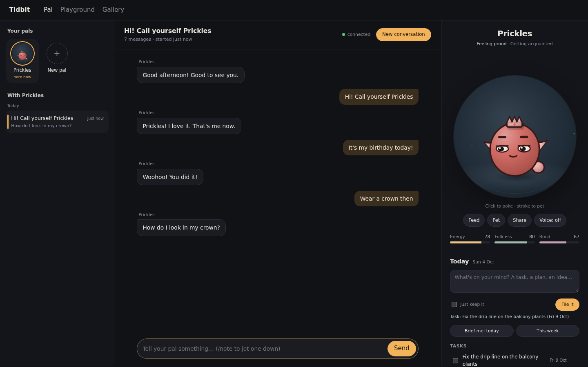
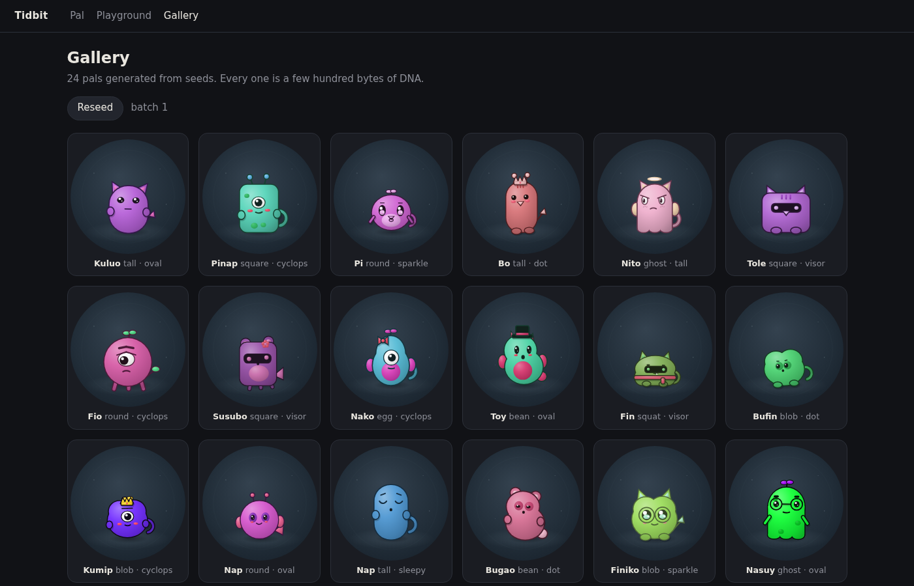

# Tidbit

A tiny AI pet that lives in your browser (and on a small ESP32 screen), works with any
AI provider, and never generates a single image.



The model only picks small, schema-checked choices: a mood, a gesture, where to look,
some words. A procedural renderer turns those into a living character at 60 fps.
A pal's whole body is about 400 bytes of DNA, and a reply is about 150 bytes.

It's also a second brain. Jot things down and your pal files them as tasks, reminders,
memories or notes, and reads them back when you ask.

## Why I built it

In September 2026 Meta gave its Muse agent a cute companion character and a
Tamagotchi-like gadget, and OpenAI launched Dots, its bubbly always-on agents. Every
assistant was getting a face. I wanted to know how hard it is to build one of these
without generating any images or media, running on my own machine, with whatever AI
provider I like. Turns out, not that hard. The full story is in
[the launch post](https://bnap.dev/blog/tidbit-an-ai-pet-that-never-generates-an-image).

## Try it

```bash
pnpm install
pnpm dev        # open http://127.0.0.1:5174
```

You don't need an API key. Without one, a rule-based brain runs everything offline.
When you want a real model, add a few lines to `.env`. Anthropic, OpenAI, Google, Groq,
your ChatGPT subscription or a local Ollama all work through the [pi SDK](https://pi.dev).

```bash
cp .env.example .env
# PAL_PROVIDER=anthropic
# PAL_MODEL=claude-sonnet-5
# ANTHROPIC_API_KEY=...
```

Requires Node 22.19+ and pnpm 10.

## What's inside

| Out of the box                                       | With a little setup                             |
| ---------------------------------------------------- | ----------------------------------------------- |
| Billions of procedurally drawn pals, 60 fps          | Any AI provider, cloud or local                 |
| Moods, gestures, effects, idle activities            | Home Assistant: lights, sensors, scenes, Assist |
| Poke, pet, feed; needs that drift; growth            | Phone notifications through ntfy                |
| Memories, reminders, routines, weather               | Web search (Brave or SearXNG)                   |
| Notes, tasks and briefings that file themselves      | Any webhook: n8n, Zapier, your own API          |
| SKILL.md skills, natural voice, multi-device pairing | A pal on an ESP32 AMOLED screen with voice      |



## Docs

- [Features](docs/FEATURES.md): everything that works with zero setup
- [Setup](docs/SETUP.md): models, phone access, voice, search
- [Integrations](docs/INTEGRATIONS.md): Home Assistant, ntfy, webhooks, skills
- [How it works](docs/HOW-IT-WORKS.md): DNA, turns, the rig and the brain
- [Device](docs/DEVICE.md): the ESP32 firmware and device API
- [Development](docs/DEVELOPMENT.md): scripts, tests and ground rules

## License

[MIT](LICENSE)
