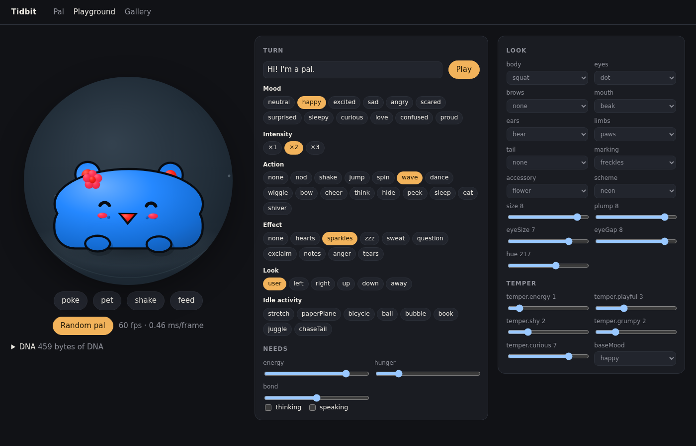

# What Tidbit does out of the box

Everything on this page works right after `pnpm install && pnpm dev`. You don't need
an API key, an account or a network connection. With no model configured, the brain
runs `ScriptedBrain`, a rule-based stand-in, so you can see the whole product before
you connect an AI provider.

Connecting a model ([SETUP.md](SETUP.md)) makes the conversation smarter. It doesn't
unlock any extra screens.

## A pet that is alive without the AI

Open `/` and you get a pal. It breathes, blinks, glances around and follows your
pointer. It watches while you type. None of that calls a model. The idle layer is a
pure function of time and the pal's seed.

- **Poke, pet, shake and feed.** It squishes when poked, leans into petting and chews
  its snacks.
- **Needs** (energy, hunger, bond) drift over time and colour its behaviour. A tired
  pal rests more slowly. A hungry one tells you.
- **Idle activities.** Leave it alone for a while and it entertains itself. It throws a
  paper plane, rides a bicycle, kicks a ball, blows bubbles, reads, juggles,
  stretches or chases its tail. It drops the activity the moment you come back.
- **It grows** from baby to kid to grown-up as you bond.
- **60 fps**, enforced by an end-to-end test on the main stage and on a 24-pal gallery.

## Billions of pals, a few hundred bytes each

A pal's whole appearance is its DNA: about 20 enum and number fields plus a seed.

| Part               | Options                                            |
| ------------------ | -------------------------------------------------- |
| Body               | blob, round, tall, squat, bean, ghost, egg, square |
| Eyes, mouth, brows | 8 eye styles, 6 mouths, 3 brow styles              |
| Ears, limbs, tail  | 8 ear types, 6 limb types, 6 tails                 |
| Marking, accessory | 6 markings, 8 accessories                          |
| Colour             | 360 hues × 7 colour schemes                        |

- `/gallery` shows 24 random pals. **Reseed** rolls another 24.
- `/playground` lets you drive every part, mood, gesture and effect by hand, and
  shows the frame time.

  

- **Share a pal** as a short link (about 27 characters of DNA). Whoever opens it can
  adopt their own copy.

## It acts out every reply

Each reply is a short list of beats. A beat is a mood, a gesture, where to look, an
effect and some words.

| Picks from  | Values                                                                                         |
| ----------- | ---------------------------------------------------------------------------------------------- |
| 12 moods    | neutral, happy, excited, sad, angry, scared, surprised, sleepy, curious, love, confused, proud |
| 15 gestures | nod, shake, jump, spin, wave, dance, wiggle, bow, cheer, think, hide, peek, sleep, eat, shiver |
| 9 effects   | hearts, sparkles, zzz, sweat, question, exclaim, notes, anger, tears                           |

With a model connected, the face starts reacting while the reply is still streaming.

## Conversations that keep going

- **Multiple pals.** **Your pals** switches between them, and each keeps its own
  history.
- **New conversation** starts a fresh chat but keeps memories and personality.
  Older chats can be resumed from the menu.
- **Nothing gets lost.** Recent messages come back on refresh, and drafts are saved
  per conversation. Messages sent while the brain is down wait in a durable outbox
  and retry once it's back.
- **Memories.** The pal remembers facts about you (SQLite full-text search). Open
  **Memories** to add, edit or forget them. Long chats are summarised into memories
  every 40 turns.
- **Personality.** Humor, speaking style, movement style, interests, likes, dislikes,
  a quirk and a shared ritual. These persist separately from passing moods.
- **Change it by talking to it.** "Call yourself Pip", "wear a crown", "turn blue",
  "be sillier". Offline, the scripted brain already understands renaming, colours,
  accessories, humor and speaking style.

## A second brain that files itself

Jot anything into **Today**, or type `/note …` in the chat, without deciding where it
goes. The pal files it:

- things to do become **tasks** ("today", "by Friday", "at 5" are understood)
- appointments become **reminders**
- lasting facts become **memories**
- everything else stays a **note**

Later, ask "what did I want to change about the watering system?" and it answers
from your notes, with the date.

| Command              | Does                            |
| -------------------- | ------------------------------- |
| `/note …` or `/n …`  | Capture and let the pal file it |
| `/keep …`            | Save a note without filing      |
| `/brief` or `/today` | Today's plan in the chat        |
| `/week`              | The week ahead                  |

## Reminders, routines and the weather

- **Reminders** fire even if you only say "remind me at 5 to call mum".
- **Routines** repeat hourly, daily, on weekdays or weekly. "Every weekday at 8, give
  me a morning briefing." When one is due, the pal does the task with its tools and
  tells you.
- **Time and weather** come from Open-Meteo, which needs no key.
- **Reading web pages.** `web_fetch` reads public pages on request.
- **It speaks first** for due reminders, your first visit of the day, or when it's
  hungry or tired.

## Skills

Skills use the SKILL.md format (the same as OpenClaw and Hermes). Each pal has an
index of skills and loads one when a request matches it. Every pal ships with four:
**customize me**, **morning briefing**, **focus buddy** and **look it up**.

Paste or write your own in **Skills & actions**, or copy any skill out as SKILL.md.
When a model is connected, the pal writes its own skills after it works out a
multi-step task. It can refine those, but never yours.

## Voice

- **Browser voice**: the Web Speech API, with a voice picked per pal and pitch shifted
  by mood.
- **Natural voice**: Kokoro-82M running in a Web Worker. It's a one-time download of
  about 188 MB, offered on your first visit. It runs fastest on https or localhost.
- Each pal has a **timbre** (warm, bubbly, posh, gruff, impish and more) that picks
  its voice.
- Pets, feeds and pokes make little synthesised sounds while voice is on.

## Your devices

Each browser gets a private owner identity, stored locally. **Your devices** creates
a one-time pairing code (valid for ten minutes) so your phone and laptop share the
same pals. Want to try the device protocol without hardware? Run `pnpm device-sim`.

---

Next: [connect a model and set up the extras](SETUP.md) ·
[Home Assistant and other integrations](INTEGRATIONS.md)
